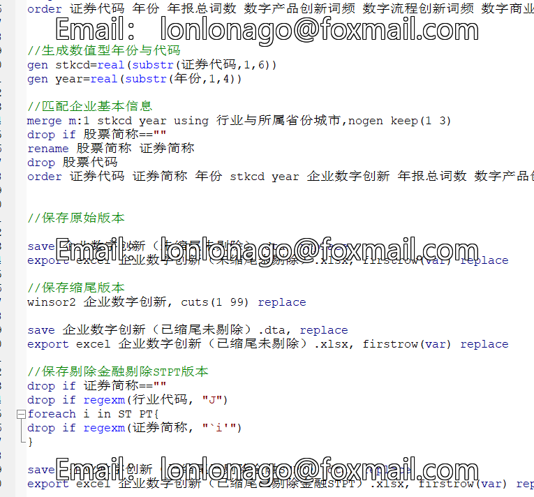
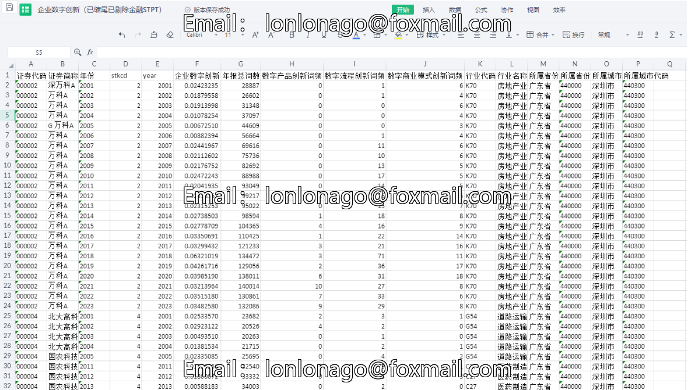

# Complete Corporate Digital Innovation Data Set (2001-2023)

1. Dataset Name: Digital Innovation Data of Listed Companies from 2023 to 2001
2. Methodology: Following the approach of Professor Zheng Panpan (2024), this study measures corporate digital innovation (DI) based on annual reports of listed companies, integrating text analysis and machine learning methods. The specific steps are as follows:
    a. Identify seed sets of digital innovation expressions in corporate annual reports. This paper closely follows the definition of digital innovation as outlined in relevant literature [2-4,6], selecting seed sets from official documents such as the "Small and Medium Enterprise Digital Empowerment Action Plan" and the "Digital Transformation Trend Report" in 2020, including 45 terms such as artificial intelligence, data mining, e-commerce, etc.
    b. Expand the seed set through machine learning methods. Given that the same concept or matter can often be expressed using multiple synonyms with similar meanings, this study applies machine learning algorithms to expand the keyword set. Specifically, using Word2vec neural network for similar word algorithm, extracting the first 30 similar keywords for each seed set, removing duplicates and some low-frequency words. After three professionals classify and validate the definition according to Fichman et al.'s [3] criteria, we obtained a total of 99 keyword sets, as shown in Table 2.
    c. Measure corporate digital innovation. This paper captures keywords related to digital innovation in corporate annual reports, summing up the frequency of the three dimensions of digital product innovation (DI_prod), digital process innovation (DI_proc), and digital business model innovation (DI_buss) across all keywords in the annual report to calculate the overall digital innovation DI. To avoid small data volume issues, we multiply the above indicators by 100.

3. Data scope: 61,000 samples, 5,598 companies, including raw data word frequencies and final calculation results, which can be verified for accuracy!

## 图片

Here is a pay link on Stripe ( https://buy.stripe.com/3cs8yP7sY87d0vu9AB ). Please contact me lonlonago@foxmail.com after funding $89, and I will send you a complete data files , thank you!

